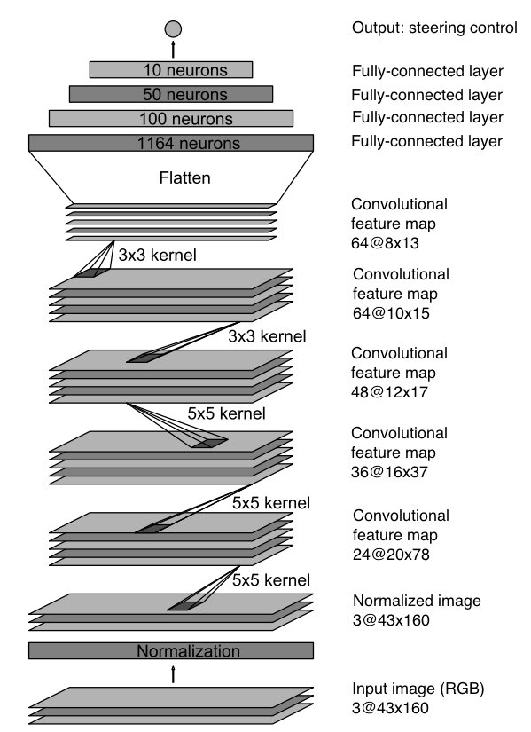
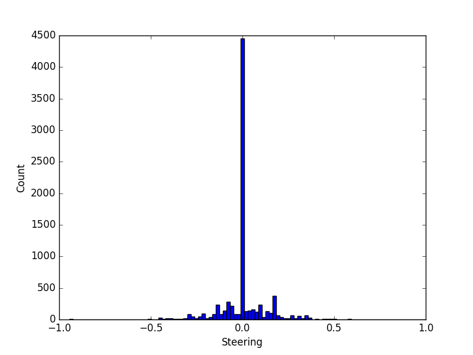
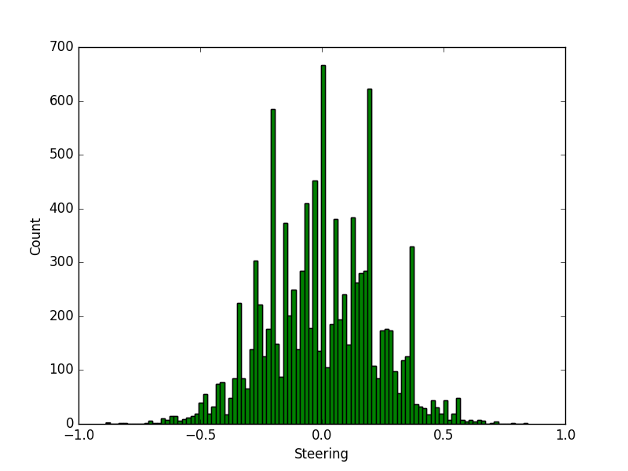

# Network Architecture Overview

# Sample Usage

To use this model first launch the Udacity Self Driving Car Nanodegree Simulator and enter "Autonomous Mode". Once the simulator is live, launch the trained model by running `python drive.py model.json` and watch it take control of the vehicle.

# Model Architecture

The implemented model architecture is largely based on the NVIDIA model: [End to End Learning for Self-Driving Cars](https://arxiv.org/pdf/1604.07316v1.pdf).

This model uses 5 convolutional layers followed by 4 fully connected layers. All layers feature an ReLU activation layer on their output  to introduce non-linearities into the model.

Furthermore, all convolutional layers included some form of down sampling: a stride greater than 1 was used for the first 3 layers, and all layers used a valid padding. These value were chosen to improve the speed of learning while balancing minimal impact on performance as observed on the simulator.

No dropouts were included in the original NVIDIA model and none were introduced here. Dropouts are typically included to minimize over-fitting but through the training process it seemed that over-fitting minimization techniques implemented in the data augmentation step were satisfactory on their own.

# Training Data

 

The training data used for the model was derived the data set provided by Udacity which consisted of 8036 images with their respective steering, braking control and vehicle velocity values. In addition, left and right camera angles were provided to compliment each center image.

The process of generating the training data from this set was the critical step in the learning approach. The approach was divided into two steps: pre-process and real-time data augmentation.

The pre-process step was primarily

The real-time data augmentation step consisted of
