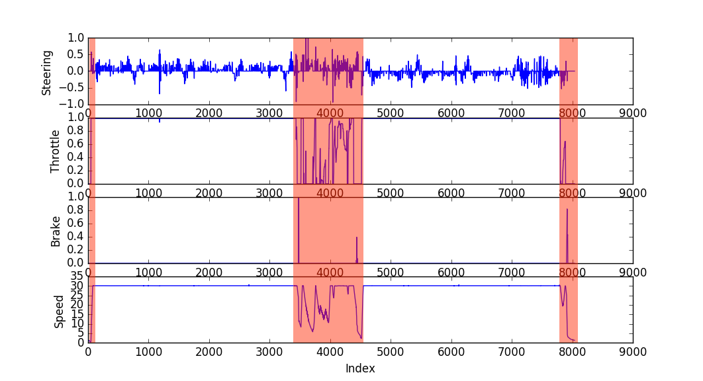
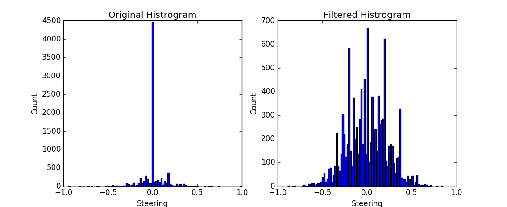

# udacity.carnd.behavioral-cloning

# Sample Usage

To run this model first launch the Udacity Self Driving Car Nanodegree Simulator and enter "Autonomous Mode". Once the simulator is live, launch the trained model by running `python drive.py model.json` and watch as it takes control of the vehicle!

# Model Architecture Overview

The implemented model architecture is largely based on the NVIDIA model: [End to End Learning for Self-Driving Cars](https://arxiv.org/pdf/1604.07316v1.pdf).

The model uses 5 convolutional layers followed by 4 fully connected layers. All layers feature a rectifier linear unit (ReLU) activation layer on their output which introduce non-linearities into the model.

Furthermore, all convolutional layers included some form of down sampling: a stride greater than 1 was used for the first 3 layers, and all layers used a valid padding. These value were chosen to improve the speed of learning while balancing minimal impact on performance observed on the simulator.

No dropouts were included in the original NVIDIA model and none were introduced here. Dropouts are typically included to minimize over-fitting but throughout the design and training process it seemed that over-fitting minimization techniques implemented in the data augmentation step were satisfactory on their own.

In total the model has 8,002,167 parameters which are learned through the training process.

# Training Data

The training data used for the model was derived from the data set provided by Udacity. This data set consisted of 8036 images of simulator driving on a single track. Along with the images, their respective steering, braking control and vehicle velocity values were provided. Finally, left and right camera angle perspectives were also provided to compliment each center image (for a total of 24,108 images).

The process of generating the training data from this set was the critical step in the learning approach. The approach was divided into two steps: pre-process and real-time augmentation.

## Pre-process

The pre-process step primarily dealt with removing images that were deemed unnecessary or even misleading. The data set contained an initial and final section which were primarily ramping up and slowing down and not actually normal driving conditions. This can be seen in the erratic steering, and speed trace shown below. Around 3500 images in there was also another erratic driving period which was not smooth or representative of normal driving. For these reasons, these three sections of data, highlighted in red below, where removed from the data set.

The original data set was also highly biased towards straight line driving. This is shown below in the left most histogram. By selecting a random set of 500 images from the subset of 0 steer images the distribution was made to be much more representative of a normal distribution. This results in a much more balanced data set which does not bias the model toward a propensity to drive straight as much as the original set.

The final pre-process step was to assign a steering angle to the left and right camera angle perspectives and use those images in the learning process. This triples the amount of data available and also provides essential data to 'show' the model to recover from driving close to the edge of the road without needed to actually drive close to the edge. A steering offset of 0.2 was added/subtracted from the left and right images as compared to the center image. This value was chosen arbitrarily and tuned in various model training iterations.

The final set of images in the data set consisted of 10,725 (from the original 24,108).

## Real-time Augmentation

The real-time augmentation step consists of various operations performed on images and labels during the training phase. This was implemented in a python generator which is used to load augmented images and labels into memory *one batch a time*. The augmentation process is performed on each batch which itself is randomly sampled. The operations consist of:
*  Brightness - the brightness of an image was modified by scaling it with a multiplier sampled from a uniform distribution. The idea is to make the model learn the required features for the task regardless of whether an image is dark or light.
* Horizontal flip - each image was horizontally (left/right) flipped at random by performing a coin toss. The sign on the steering angle was also flipped. The motivation is to increase the number of images to learn from by realizing that if the scene is horizontally flipped, the features to be learned should be the same.
* Steering variation - each steering label had an offset added to it that was sampled from a normal distribution with a *small* standard deviation. This effectively increases the number of training samples to learn. The justification for this offset is in that the steering command from a driver is not a deterministic process and has some randomness in it. Therefore, it is to be expected that two hypothetically identical scenes may have distinct, albeit similar values.
